# Мини-отчёт об инциденте — SOC_Tarek_20260706

**Rule Name:** SEO Poisoning → Trojanized Installer → Destructive Wiper (NimbusWiper)
**Тип инцидента:** SEO Poisoning / Supply Chain Imitation / AppDomainManager Injection / Wiper Attack

---

## Кратко

6 июля 2026 года пользователь tarek.soliman выполнял настройку новой рабочей станции и скачивал популярное ПО через поисковик. В результате SEO-отравления он перешёл на мошеннический домен `zooomsuppoertoinstall.com` и скачал архив `zoom.7z`, содержащий троянизированный установщик `ZoomInstallerFull.exe`. Установщик использовал технику AppDomainManager Injection (T1574.014) для скрытой загрузки вредоносной DLL `ZoomSetupCore.dll`, которая сбросила на диск C2-beacon `Update.exe` и деструктивный вайпер `byebye.exe` (NimbusWiper). Вайпер выполнил тройную перезапись всех файлов в `C:\Users`, попытался удалить теневые копии, остановить защитные сервисы и очистить 6 каналов журналов событий Windows, что привело к полной потере пользовательских данных.

---

## Хронология / вектор атаки

| Этап (MITRE ATT&CK) | Техника | Действие |
|---|---|---|
| Initial Access | T1566 / T1189 — Drive-by / SEO Poisoning | Пользователь попал на фишинговый домен `zooomsuppoertoinstall.com` через поисковую выдачу |
| Initial Access | T1204.002 — User Execution: Malicious File | Пользователь скачал и запустил `ZoomInstallerFull.exe` из архива `zoom.7z` |
| Defense Evasion | T1574.014 — AppDomainManager Injection | `.config`-файл перенаправил CLR на загрузку вредоносной сборки `ZoomSetupCore.dll` до старта легитимного кода |
| Defense Evasion | T1036.005 — Masquerading | `ZoomInstallerFull.exe` — подписанный бинарник; DLL маскируется под "Zoom Video Communications, Inc."; вайпер — под "Windows Disk Utility / Microsoft Corporation" |
| Execution | T1059.001 — PowerShell | `ZoomSetupCore.dll` создала scheduled task через PowerShell с Base64-encoded командой (`-EncodedCommand`) |
| Persistence | T1053.005 — Scheduled Task Hijack | Hijack легитимной задачи `ZoomUpdateTaskUser-S-1-5-21-403280985-4081385913-4248903659-1002`, созданной установщиком Zoom; метод `PollAndHijackTask()` ждал появления задачи и подменял её Action на `Update.exe` |
| Command & Control | T1105 — Ingress Tool Transfer | `ZoomSetupCore.dll` извлекла embedded resource `ZoomSetupCore.payload.Update.exe` и сбросила C2-beacon `Update.exe` в `C:\Users\tarek.soliman\AppData\Roaming\ZoomUpdate\` |
| Defense Evasion | T1562.001 — Impair Defenses | NimbusWiper остановил сервисы Sysmon (`SVC_SYSMON`, `SVC_SYSMON64`) через `sc.exe stop` |
| Defense Evasion | T1070.001 — Clear Windows Event Logs | Очистка 6 каналов: Security, System, Application, Sysmon/Operational, PowerShell/Operational, TaskScheduler/Operational через `wevtutil cl` и `auditpol /clear /y` |
| Impact | T1490 — Inhibit System Recovery | Попытка удаления теневых копий: `vssadmin.exe delet shadows /all /quiet` (опечатка — команда не выполнилась) |
| Impact | T1485 — Data Destruction | NimbusWiper (`byebye.exe`) выполнил тройную перезапись (нули → случайные байты → 0xFF) всех файлов в `C:\Users`, после чего удалил их через `File.Delete()` |

---

## Развитие атаки по модели Cyber Kill Chain

**Reconnaissance.**
Атакующий заранее идентифицировал популярные утилиты, которые системные администраторы устанавливают при настройке новых машин (Zoom, VLC, Everything, 7-Zip, MS Teams, Obsidian). Под каждый из таких запросов были подготовлены SEO-оптимизированные страницы на мошеннических доменах.

**Weaponization.**
Был подготовлен многокомпонентный пакет: архив `zoom.7z`, содержащий подписанный .NET-бинарник `ZoomInstallerFull.exe`, вредоносный конфиг `ZoomInstallerFull.exe.config`, DLL-дроппер `ZoomSetupCore.dll` с embedded C2-beacon (`ZoomSetupCore.payload.Update.exe`), decoy-установщик `ZoomHelper.exe` и деструктивный вайпер `byebye.exe` (NimbusWiper). DLL подделывала метаданные PE под "Zoom Video Communications, Inc.", а вайпер — под "Windows Disk Utility / Microsoft Corporation".

**Delivery.**
Пользователь нашёл "официальный" сайт Zoom через поисковик (Bing), однако SEO-отравление вывело в топ мошеннический домен `zooomsuppoertoinstall.com`. С него был скачан архив `zoom.7z` (тип: `application/x-7z-compressed`). Время скачивания зафиксировано в Edge/Chrome History (`tab_url: http://zooomsuppoertoinstall.com/`).

**Exploitation.**
Пользователь вручную запустил `ZoomInstallerFull.exe`. CLR прочитал `.config`-файл и до старта `Main()` легитимного бинарника загрузил класс `ZoomSetupCore.ZoomSetupManager` (AppDomainManager Injection, T1574.014). Начиная с этого момента вредоносный код исполнялся в контексте доверенного, цифровопод-писанного процесса.

**Installation.**
- `ZoomSetupCore.dll` извлекла embedded resource → записала `Update.exe` в `C:\Users\tarek.soliman\AppData\Roaming\ZoomUpdate\` (12:31:53 PM).
- Метод `PollAndHijackTask()` ждал появления легитимной задачи `ZoomUpdateTaskUser-S-1-5-21-403280985-4081385913-4248903659-1002` и дважды подменил её Action (второй раз — с ошибкой пути: `C:\Users\Administrator\...` вместо `tarek.soliman`).
- Fallback: через PowerShell `-EncodedCommand` зарегистрирована задача `ZoomUpdateService` (триггер: AtLogOn).
- `ZoomHelper.exe` запущен параллельно как decoy для имитации нормальной установки.

**Command & Control.**
`Update.exe` (C2-beacon, первый запуск ~12:32 PM) обеспечивал связь с командным сервером. Точный C2-адрес требует дополнительного анализа сетевых артефактов (PCAP/DNS-логи). В коде `ZoomSetupCore.dll` зафиксирован первоначальный beacon на `voyagemist[.]space` (из смежных OSINT-отчётов по схожей инфраструктуре OfferLoader/PPI).

**Actions on Objectives.**
Деструктивный вайпер `byebye.exe` (NimbusWiper, `NimbusWiper.WiperCore.Main`):
1. Остановил защитные сервисы Sysmon.
2. Попытался удалить теневые копии (неудачно — опечатка в аргументе: `delet` вместо `delete`).
3. Очистил 6 каналов Event Log.
4. Выполнил тройную перезапись и удаление всех файлов в `C:\Users` → полная потеря пользовательских данных.

---

## Результат анализа

- **Домен доставки:** `zooomsuppoertoinstall.com` (HTTP, тайпсквоттинг под `zoom.us`) — мошеннический, не имеет отношения к Zoom Video Communications.
- **Файл-дроппер:** `ZoomInstallerFull.exe` — SHA1: `60c41ed1281ad3ae521a33938db291c85d46e78a`; OriginalFileName в PE-заголовке: `vsn.exe`; фальшивый Publisher: "Microsoft Corporation"; дата компиляции: 10/18/2087 (намеренная фальсификация таймстампа).
- **Вредоносная DLL:** `ZoomSetupCore.dll` — маскируется под "Zoom Video Communications, Inc.", версия 5.17.11.0; содержит embedded C2-beacon `ZoomSetupCore.payload.Update.exe`.
- **Вайпер:** `byebye.exe` — NimbusWiper, AssemblyTitle "Wiper", маскируется под "Windows Disk Utility / Microsoft Corporation".
- **Техника закрепления:** Hijack scheduled task `ZoomUpdateTaskUser-S-1-5-21-403280985-4081385913-4248903659-1002` + fallback задача `ZoomUpdateService`.
- **Масштаб:** Один хост (`tarek.soliman`); распространение по сети не выявлено.
- **Обойденные защиты:** Sysmon остановлен; Event Logs очищены; файл запущен в контексте подписанного бинарника (обход репутационных проверок по подписи).
- **Попытка уничтожения recovery:** Теневые копии VSS — попытка неудачна (опечатка в команде).
- **Статус хоста:** Все пользовательские файлы уничтожены; требуется переустановка ОС и восстановление из резервной копии.

---

## Скриншоты

**Delivery — источник загрузки**

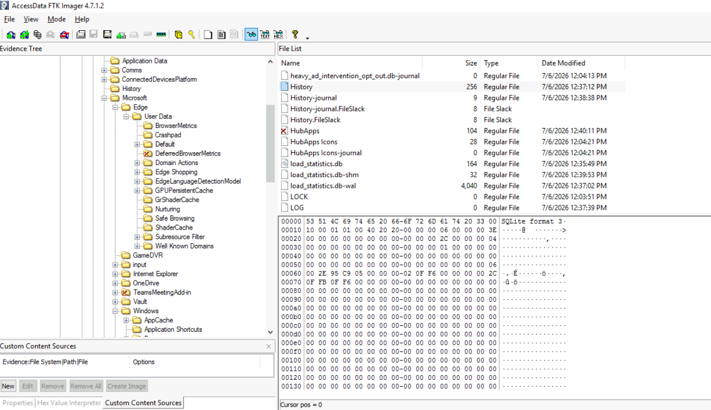

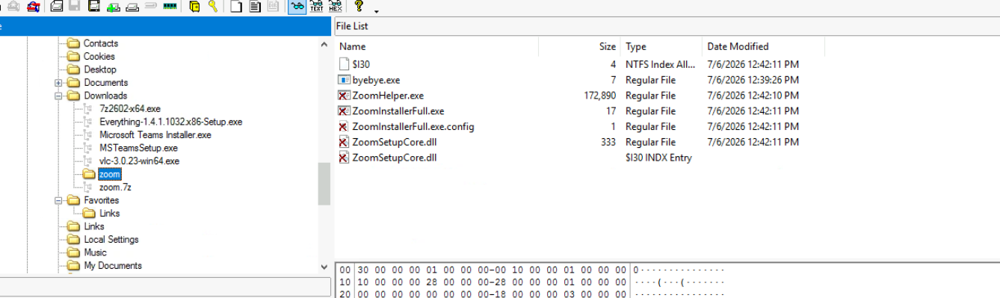

**Идентификация дроппера**

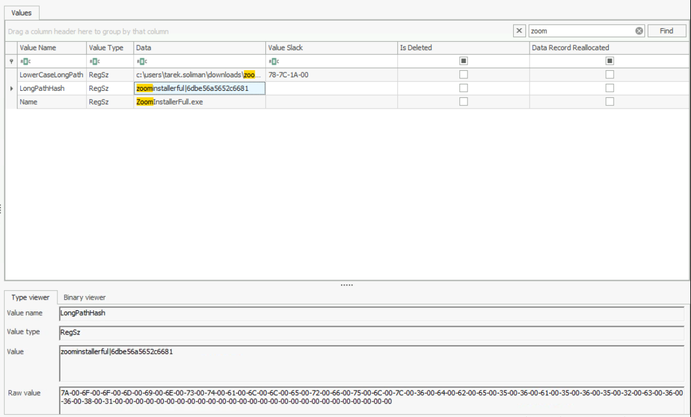

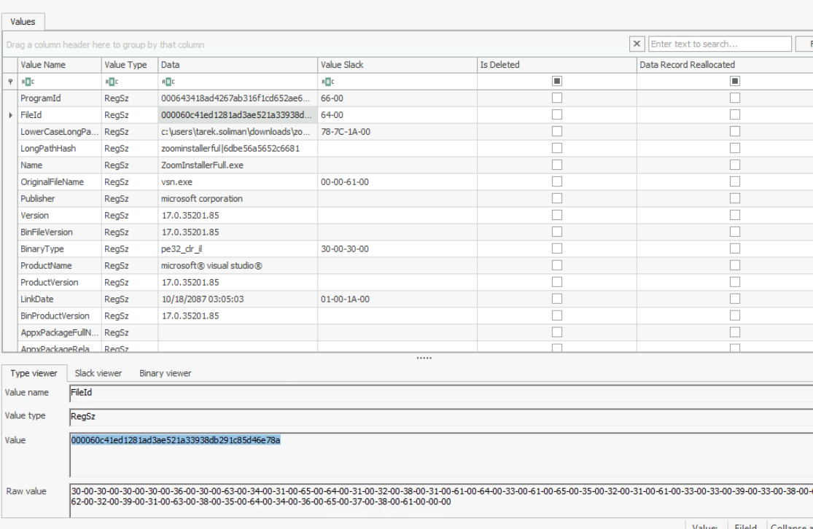

**AppDomainManager Injection (T1574.014)**

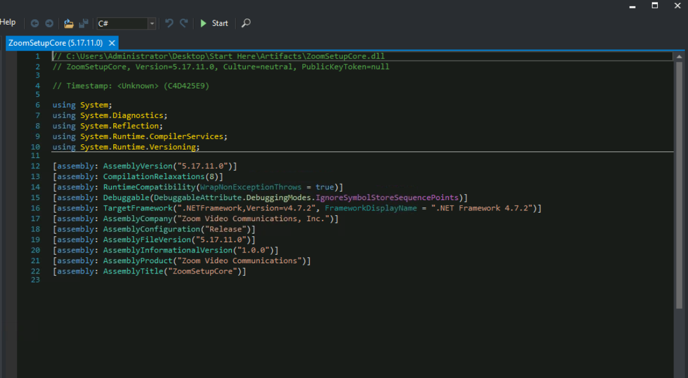

**Persistence — захват scheduled task (T1053.005)**

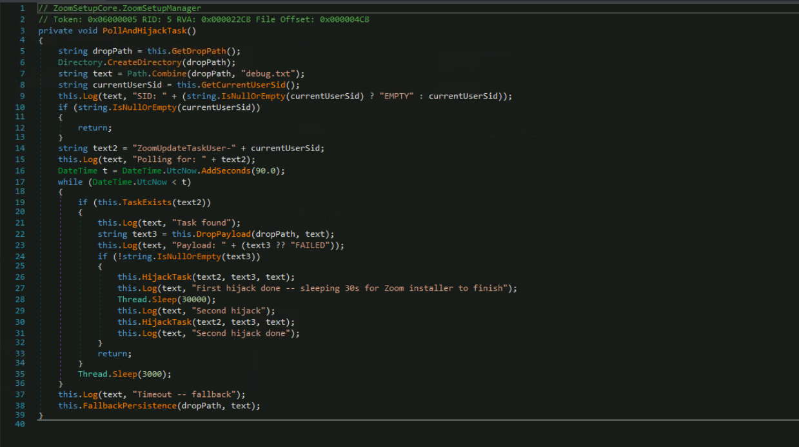

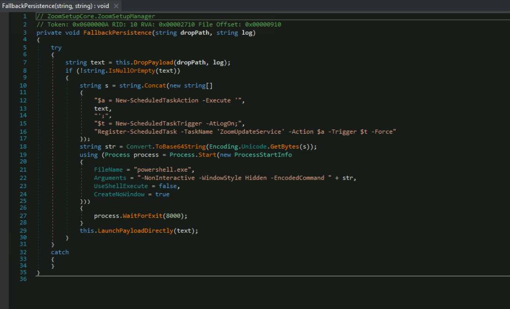

**Доставка C2-beacon**

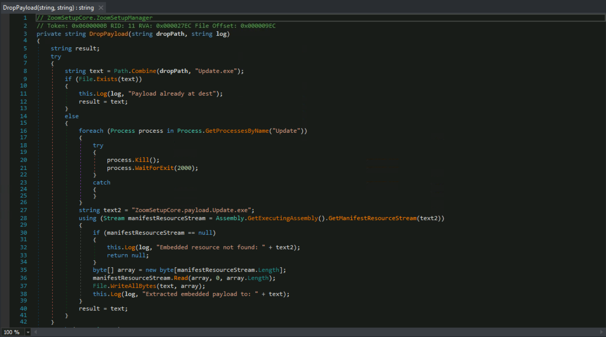

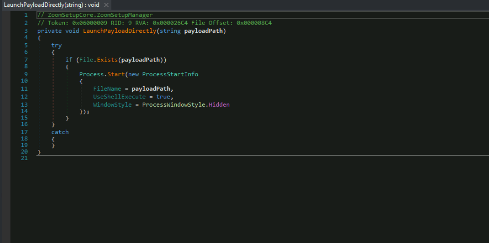

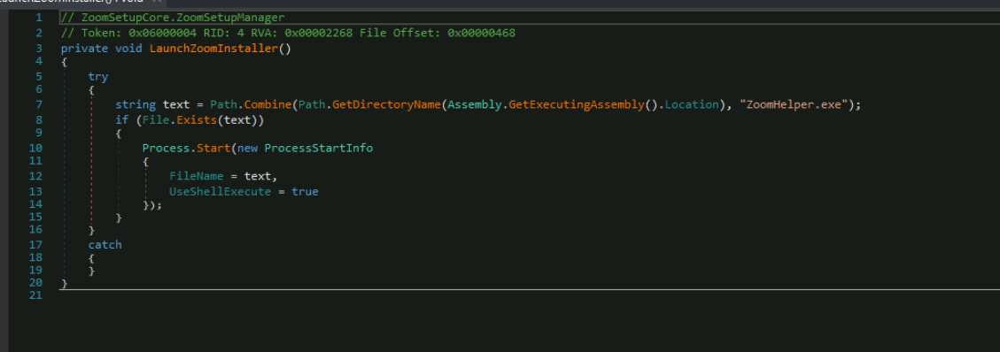

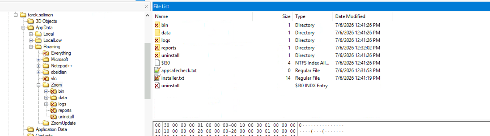

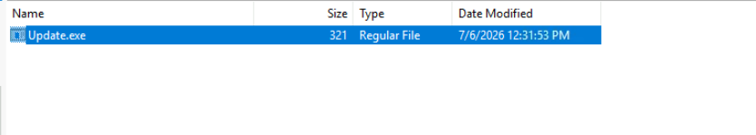

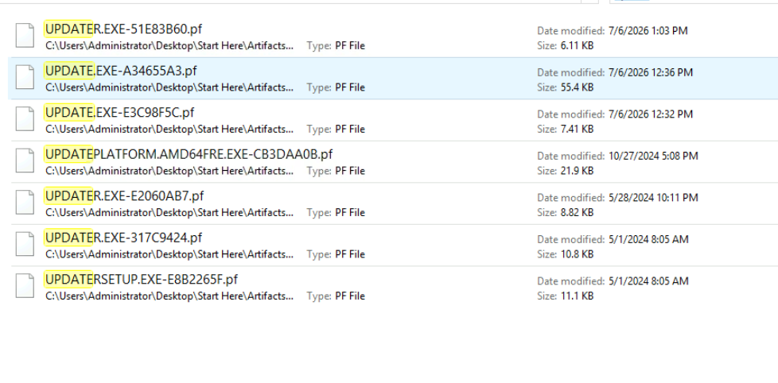

**Деструктивная нагрузка — NimbusWiper (byebye.exe)**

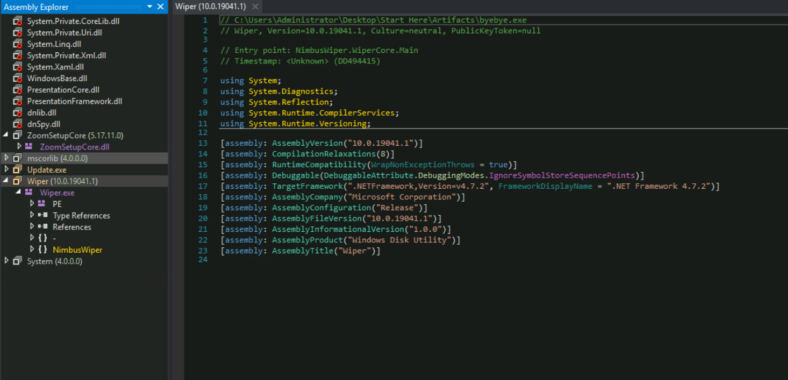

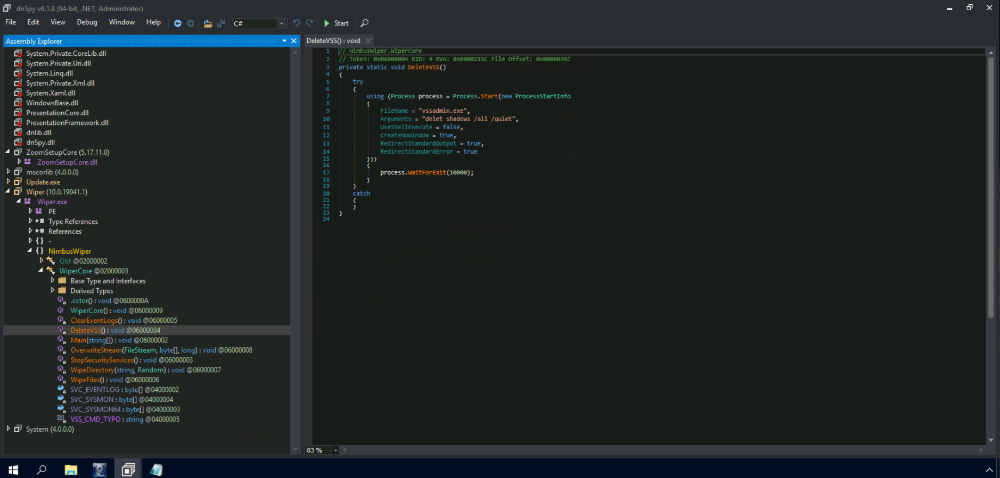

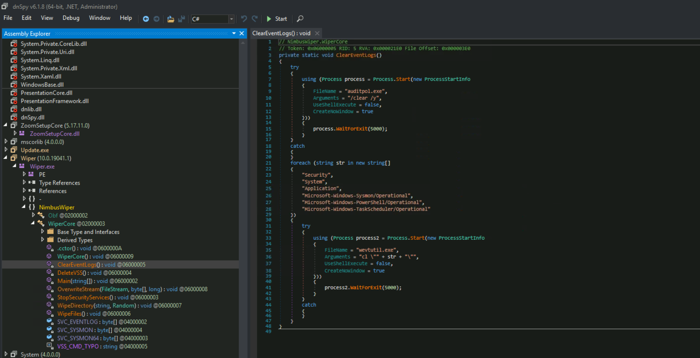

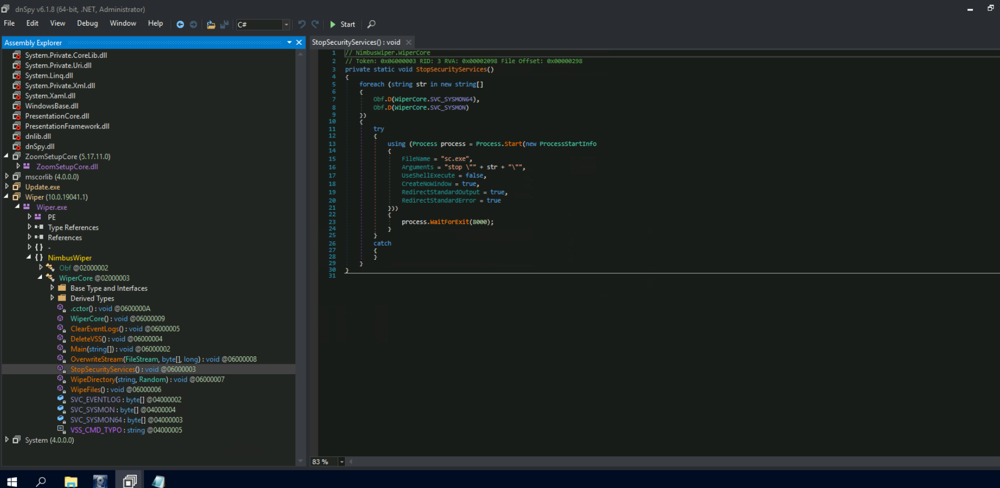

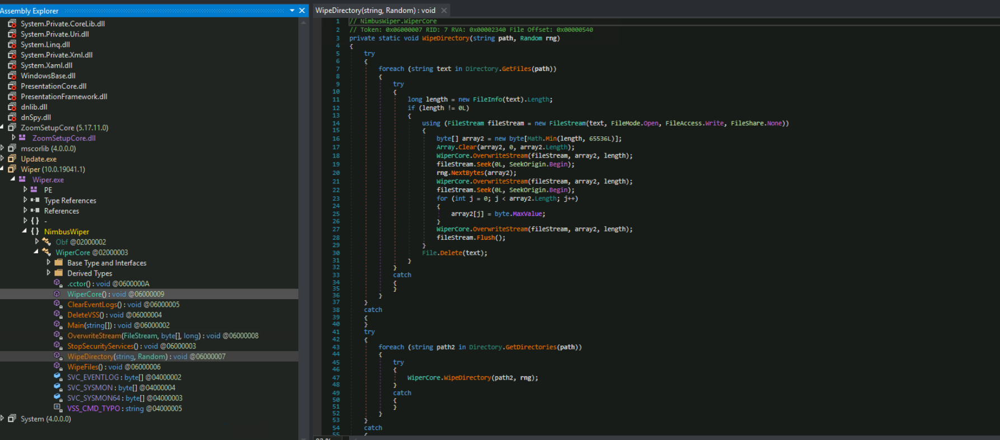

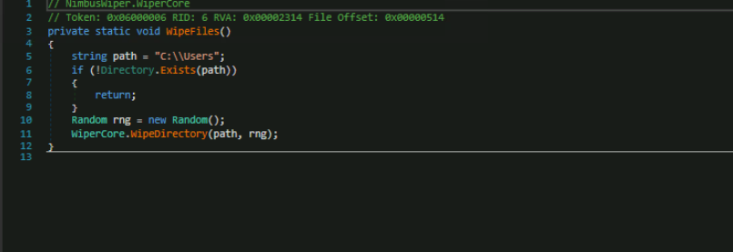

---

## Рекомендации

- **Восстановление:** Немедленно изолировать хост; восстановить данные из актуальной резервной копии (не с данного хоста — все файлы уничтожены); переустановить ОС.
- **DNS/Сеть:** Заблокировать домен `zooomsuppoertoinstall.com` и IP-адреса его инфраструктуры на уровне DNS-фильтра и прокси; добавить в блок-лист C2 `voyagemist[.]space`.
- **IOC-блокировка:** Добавить SHA1 `60c41ed1281ad3ae521a33938db291c85d46e78a` (`ZoomInstallerFull.exe`) и хеши `ZoomSetupCore.dll`, `byebye.exe` в EDR/AV-исключения (для детектирования, не для разрешения).
- **AppDomainManager Injection:** Настроить мониторинг создания файлов `*.exe.config` рядом с исполняемыми файлами в пользовательских директориях (`Downloads`, `Temp`, `AppData`); добавить правило Sigma/Sysmon на наличие `appDomainManagerAssembly` в `.config`-файлах.
- **Scheduled Tasks:** Мониторинг изменений существующих scheduled tasks (особенно задач, созданных легитимными приложениями); алерт на любое изменение `Action/Command` в задачах Zoom, Teams и других корпоративных приложений.
- **PowerShell:** Включить Script Block Logging и Transcription; алерт на `-EncodedCommand` в аргументах PowerShell, запущенного дочерним процессом от `*.exe` из `Downloads`.
- **VSS/Теневые копии:** Настроить алерт на вызовы `vssadmin delete shadows` и `wmic shadowcopy delete`; рассмотреть защиту VSS через Microsoft's VSS Protection (Windows Server).
- **Sysmon:** Развернуть Sysmon с расширенной конфигурацией (SwiftOnSecurity/sysmon-config); настроить алерт на попытку остановки службы Sysmon (`sc stop sysmon`).
- **Event Log Protection:** Настроить централизованный SIEM/log forwarding (Splunk, Elastic, Wazuh) — локальные логи были уничтожены вайпером, что существенно затруднило форензику.
- **Пользовательское обучение:** Провести тренинг по проверке URL перед скачиванием ПО; внедрить политику разрешённых источников для загрузки корпоративного ПО (Software Center / SCCM / внутренний репозиторий).
- **Резервное копирование:** Проверить наличие актуальных резервных копий для всех рабочих станций; рассмотреть правило 3-2-1 (3 копии, 2 носителя, 1 offsite/offline).
